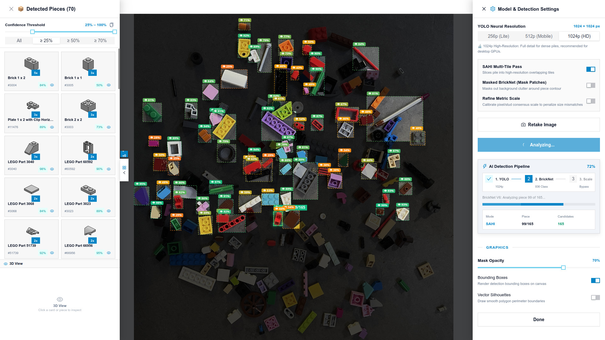
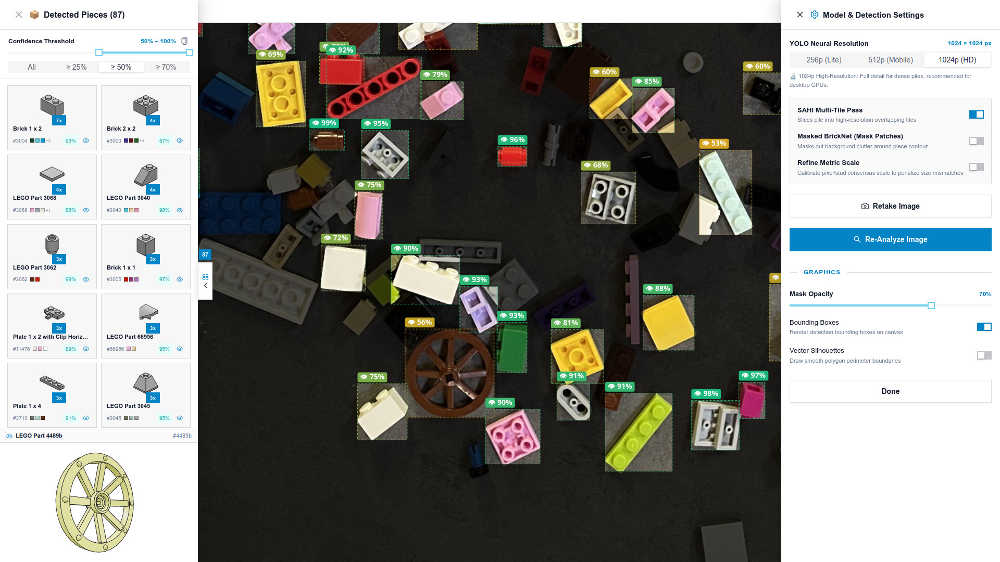
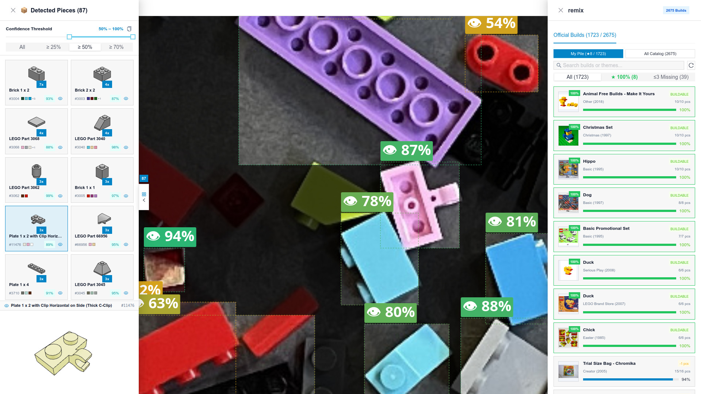

# 🧱 Brickator 3000 🧱

> **An experimental, real-time Client-Side LEGO parts detector**  
> Identifies, segments, and catalogs mixed piles of physical LEGO bricks 100% locally in your browser using WebGL/WASM, no cloud, no latency.
---
## Features

- **100% In-Browser detection**:
- 
  - **YOLO11-seg** instance segmentation with optional SAHI (Slicing Aided Hyper Inference) for dense piles.
  - **BrickNet V6** classification (MobileNetV3-Large, 936 canonical LDraw part classes).
  - **Physical Metric Consensus (experimental)** try to infer stud pitch $\text{px}/\text{stud}$ filtering to eliminate scale mismatches.
- **Interactive 3D WebGL Part Inspection**:
  
  - LDraw 3D geometry rendering for the 936 supported classes.
  - Client-Side LEGO Remix Assistant: instant multiset matching of detected pieces against 1,500+ official LEGO micro-builds (8–75 pieces). missing piece counts and step-by-step instructions.

  
- **Offline Training**:
  - Training and fine-tuning scripts for YOLO11-seg and BrickNet V6.
  - checkpoint weights (`.pt`) and pre-exported WebGL ONNX models (`.onnx`).
  - Headless 3D path-tracing and physics simulation engine to synthesize training datasets.
  
## Documentation:
I collected some papers along the project, they're available unde : [docs/papers](./docs/papers/)


## Thanks and Acknowledgements

- 3D models of all the pieces by LDRAW https://www.ldraw.org/
- Path tracer by Garrett Johnson: https://threejs.org/examples/webgl_renderer_pathtracer.html  
- Headles WebGL by Renaud Rohlinger https://github.com/RenaudRohlinger/node-webgl
- Realtime 3D physics by Stefan Harr  https://schteppe.github.io/cannon.js/
- remix dataset by Rebrickable https://rebrickable.com/ 
- Three.JS https://threejs.org/

---

## Running the App Locally

### Prerequisites
- Node.js $\ge 18$
- Modern browser with WebGL2 (Chrome, Firefox, Edge, Safari)

### 1-Step Launch
```bash
git clone https://github.com/your-username/brickator3000.git
cd brickator3000
./start_app.sh
```

Or manually:
```bash
cd app
npm install
npm run dev
```

Open **`https://localhost:5173/`** in your browser.  
*(Accept the self-signed HTTPS certificate generated by `@vitejs/plugin-basic-ssl` — HTTPS is required by browsers to access the webcam and WebGL shared buffers).*


---

## Repository Structure

```
brickator3000/
├── app/                               # Client-Side Vision Web Application
│   ├── package.json                   # Web dependencies (React 19, Ant Design 6, Three.js, ONNX Runtime Web)
│   ├── vite.config.ts                 # HTTPS & LDraw subpart resolution middleware
│   ├── src/                           # TypeScript React source code
│   │   ├── App.tsx                    # Root UI, scan HUD, piece drawers, remix modal
│   │   ├── inference.ts               # BrickNet ONNX classifier runtime
│   │   ├── yolo_segmenter.ts          # YOLO11-seg instance segmentation & SAHI
│   │   ├── measure.ts                 # Metric stud-pitch consensus & physical re-ranking
│   │   ├── viewer3d.ts                # Three.js LDraw 3D part loader
│   │   └── remixMatcher.ts            # Micro-build multiset matcher
│   └── public/
│       ├── models/                    # Latest ONNX weights for in-browser inference
│       │   ├── bricknet_v6_decomposed.onnx  (21.6 MB)
│       │   ├── yolo11n_seg_1024.onnx        (11.9 MB)
│       │   ├── yolo11n_seg_512.onnx         (11.6 MB)
│       │   └── yolo11n_seg_256.onnx         (11.5 MB)
│       ├── data/                      # 936-class taxonomy, metric priors, remix catalog
│       ├── ldraw/                     # Self-contained 936-part 3D CAD library + primitives
│       └── thumbnails/                # 2D preview images for parts drawer
│
├── training/                          # Model Training & Synthetic Data Suite
│   ├── config/                        # Class mappings (class_indices.json) & YOLO config
│   ├── weights/                       # PyTorch checkpoints (bricknet_v6_best.pt, yolo11n_seg_best.pt)
│   ├── train_bricknet.py              # BrickNet V6 trainer (MobileNetV3-Large, 936 classes)
│   ├── train_yolo.py                  # YOLO11-seg trainer & auto-exporter
│   ├── export_onnx.py                 # Standalone PyTorch -> ONNX / INT8 exporter
│   ├── build_yolo_dataset.py          # Polygon annotation utility
│   └── generator/                     # Headless 3D Path Tracer + Cannon.js Physics Generator
│       ├── generate_dataset.js        # Master dataset generator
│       ├── worker.js                  # Headless rendering worker
│       └── core/                      # Three.js path tracing & physics simulation modules
│
├── requirements.txt                   # Python ML dependencies
└── start_app.sh                       # Local web app launcher
```

---

## Model Training & Fine-Tuning

### Environment Setup
```bash
python3 -m venv .venv
source .venv/bin/activate
pip install -r requirements.txt
```

### 1. Fine-Tuning YOLO11-seg
Fine-tunes YOLO11n-seg on LEGO bricks and automatically exports the resulting model to `app/public/models/yolo11n_seg.onnx`:
```bash
python3 training/train_yolo.py \
  --data training/config/yolo_data.yaml \
  --epochs 80 \
  --batch 8 \
  --imgsz 1024
```

### 2. Training BrickNet V6 (936 Classes)
Trains MobileNetV3-Large using multi-stream ingestion and neighbor intrusion data augmentation, warm-starting from the bundled checkpoint:
```bash
python3 training/train_bricknet.py \
  --checkpoint training/weights/bricknet_v6_best.pt \
  --epochs 15 \
  --batch-size 64 \
  --lr 3e-4
```
Upon completion, the trained weights are automatically validated, exported to ONNX, and deployed directly to `app/public/models/`.

### 3. Re-Exporting Checkpoints to ONNX
To convert any custom checkpoint to browser-ready ONNX with optional INT8 dynamic quantization:
```bash
python3 training/export_onnx.py \
  --checkpoint training/weights/bricknet_v6_best.pt \
  --output-dir app/public/models \
  --quantize
```

---

## Synthesizing Ground-Truth Training Data

Brickator 3000 includes a standalone headless synthetic dataset generator combining **Cannon.js rigid-body physics** with the **WebGL2 Path Tracer** (`three-gpu-pathtracer`) to render photorealistic LEGO piles with exact ground-truth polygon segmentation masks.

```bash
cd training/generator
npm install
node generate_dataset.js --concurrency=4 --shots=16 --scenes=100
```
This produces:
- Single-part path-traced views across all 936 classes.
- Randomized multi-brick clutter scenes with physics settling.
- Automated YOLO polygon segmentation labels and bounding boxes.

---

## License

MIT License. LEGO® is a trademark of the LEGO Group, which does not sponsor, authorize, or endorse this project. LDraw parts are sourced from the official [LDraw.org](https://library.ldraw.org/) parts library under CA-BY-2.0.
