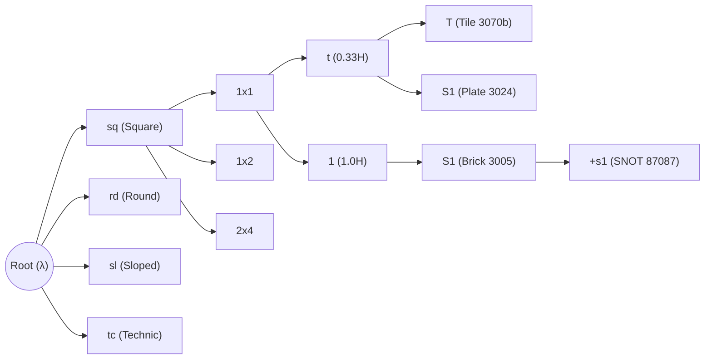

# Compact Morphological Notations, Word Graphs & Visual Force-Directed Catalogs

This document provides the theoretical foundations, literature review, and technical specification for:
1. **L-SMILES / BRICK-CODE**: A compact, canonical line notation for LEGO CAD geometries.
2. **Word Graphs & Deterministic Acyclic Word Graphs (DAWG)** for sub-millisecond autocompletion and browsing.
3. **Visual Force-Directed Graphs (FDG)** driven by a unified 13K-element texture sprite atlas.

---

## 1. Literature & Theoretical Grounding

### A. Line Notations & Grammars for Modular Solid Geometry
In chemoinformatics and materials science, complex 3D molecular structures are encoded into compact, human-readable ASCII line notations such as **SMILES** (Simplified Molecular Input Line Entry System, Weininger 1988) and **InChI** (IUPAC). SMILES allows computational engines to represent branching, aromaticity, and connectivity without storing raw 3D Cartesian coordinates.

In computational design and architecture:
* **Shape Grammars (Stiny & Gips, 1972)**: Formal production systems where spatial replacement rules generate geometric designs.
* **Graph Grammars for Modular Robotics & Assemblies (Pollack & Funes 1998, EuroGP 2006)**: Represents modular blocks (like LEGO) as typed graph nodes where edges signify physical snap-fit connections.
* **Problem**: LDraw names (e.g. `"Slope Brick Curved 2 x 2 x 0.667 with Stud Notch Left"`) are verbose, unstructured, and noisy for visual graph visualization.
* **Solution**: A **canonical compact line notation (BRICK-CODE / L-SMILES)** that extracts intrinsic geometric invariants (cross-section curvature, bounding studs, quantized height, connection interfaces) into a standard token string.

### B. Word Graphs, Tries & Minimal Acyclic Finite-State Automata (DAWG)
* **Prefix Trees (Tries)**: Tree structures where common prefixes are shared among keys. Every character/token transition represents an edge in the search tree.
* **DAWG (Directed Acyclic Word Graph / MA-FSA)**: Merges both common prefixes *and* common suffixes into a minimal deterministic directed acyclic graph.
* **Fast Graph Navigation & Dynamic Autocomplete**:
  * Instead of standard substring text searches, a word graph treats exploration as a state-machine traversal:
    $$\text{State}_0 \xrightarrow{\texttt{sq}} \text{State}_{\text{square}} \xrightarrow{\texttt{1x1}} \text{State}_{\text{1x1}} \xrightarrow{\texttt{1}} \text{State}_{\text{brick}} \xrightarrow{\texttt{S1}} \text{Part } 3005$$
  * At any state in the graph, the valid outgoing transitions immediately indicate what geometric mutations are physically available in the catalog.
  * Navigating the word graph dynamically drives the visual graph filter, clustering and focusing on candidate pieces instantly.

### C. Visual Force-Directed Graphs with Texture Sprite Atlases
* Standard DOM/SVG implementations degrade severely beyond ~1,000 nodes due to reflow and layout overhead.
* **Texture Sprite Atlas Solution**:
  * $13,474 \text{ pieces} \times 32 \times 32 \text{ pixels}$ can be arranged in a grid of 128 columns $\times$ 106 rows on a single $4096 \times 3392$ image.
  * In HTML5 Canvas2D (`ctx.drawImage`) or WebGL, rendering 13,000 textured quads from a single cached GPU texture requires only a single draw call per frame, easily sustaining 60 FPS.
* **Force Simulation Mechanics**:
  * **Link Force**: Connects ancestor primitives to derived mutations (e.g. $1 \times 1 \text{ Tile} \rightarrow 1 \times 1 \text{ Brick} \rightarrow 1 \times 2 \text{ Brick}$).
  * **Many-Body Charge Force**: Repels neighboring nodes to prevent visual overlaps.
  * **Radial / Morphological Cluster Centers**: Gravity wells grouping pieces by archetype (Square, Round, Sloped, Technic, Minifig).

---

## 2. Specification: L-SMILES / BRICK-CODE Notation

The notation decomposes any part into 4 dot-separated fields:

$$\mathbf{\langle Archetype \rangle} \boldsymbol{.} \mathbf{\langle Footprint \rangle} \boldsymbol{.} \mathbf{\langle Height \rangle} \boldsymbol{.} \mathbf{\langle Interface\ [+Modifiers] \rangle}$$

### 1. Archetype (Cross-Section & Geometry)
* `sq`: Square / Rectangular Orthogonal
* `rd`: Round / Cylindrical / Conical (Radial Symmetry)
* `sl`: Sloped / Wedge / Chamfered (Planar Angle)
* `cv`: Curved / Bow / Arch (Non-Linear Organic Curvature)
* `tc`: Technic / Kinematic (Pins, Axles, Gears, Liftarms)
* `ar`: Architectural (Panels, Frames, Windows, Doors)
* `mf`: Minifigure Anatomy & Accessories
* `dk`: Decal / Sticker / Printed Sheet (2D)
* `sp`: Specialized / Compound

### 2. Footprint Grid ($W \times L$)
* In standard stud units: `1x1`, `1x2`, `1x4`, `2x2`, `2x4`, `4x4`, etc.
* Non-grid parts use specialized descriptors: `pin`, `axle3`, `gear16`, `head`, `torso`.

### 3. Vertical Height ($H$)
* Quantized relative to standard brick height ($1.0\text{ H} = 24\text{ LDU} = 9.6\text{ mm}$):
  * `t` or `0.3`: Plate / Tile height ($1/3\text{ H} = 8\text{ LDU}$)
  * `0.7`: Two-thirds height ($16\text{ LDU}$, e.g. cheese slopes)
  * `1`: Standard brick height ($24\text{ LDU}$)
  * `2`, `3`, `5`: Extended heights ($48, 72, 120\text{ LDU}$)

### 4. Interface & Modifiers
* **Top Surface**:
  * `T`: Smooth tile top (0 studs)
  * `S<n>`: $n$ top studs (e.g. `S1`, `S2`, `S4`, `S8`)
  * `Sh`: Hollow stud
* **Modifiers & Appendages (`+`)**:
  * `+s<n>`: Side stud(s) (SNOT, e.g. `+s1`, `+s4`)
  * `+c`: Clip / Finger hinge
  * `+b`: Bar / Handle
  * `+p`: Pin / Axle connector
  * `+h`: Pin hole / Axle hole
  * `+g`: Grille / Grooved surface
  * `^`: Inverted face (e.g. inverted slope)
  * `<deg>d`: Angle specification (e.g. `31d`, `45d`, `75d`)

### Canonical Examples

| Part ID | LDraw Name | L-SMILES Shorthand |
| :--- | :--- | :--- |
| **3070b** | Tile 1 x 1 with Groove | `sq.1x1.t.T` |
| **3024** | Plate 1 x 1 | `sq.1x1.t.S1` |
| **3005** | Brick 1 x 1 | `sq.1x1.1.S1` |
| **3004** | Brick 1 x 2 | `sq.1x2.1.S2` |
| **3001** | Brick 2 x 4 | `sq.2x4.1.S8` |
| **98138** | Tile 1 x 1 Round with Groove | `rd.1x1.t.T` |
| **3062b** | Brick 1 x 1 Round with Hollow Stud | `rd.1x1.1.Sh` |
| **54200** | Slope Brick 31 1 x 1 x 0.667 | `sl.1x1.0.7.31d` |
| **11477** | Slope Brick Curved 2 x 1 | `cv.1x2.0.7` |
| **87087** | Brick 1 x 1 with Stud on Side | `sq.1x1.1.S1+s1` |
| **4070** | Brick 1 x 1 with Headlight | `sq.1x1.1.Sh+s1` |
| **3673** | Technic Pin without Friction Ridges | `tc.pin.1.p` |
| **3626b** | Minifig Head with Blocked Hollow Stud | `mf.head.1.Sh` |

---

## 3. Dynamic Word Graph (DAWG) Browsing Architecture

### Autocomplete Graph Engine
1. **Interactive Prompt**: The user types or clicks tokens (e.g. `sq` $\rightarrow$ `1x1` $\rightarrow$ `1`).
2. **Instant Graph Filtering**: Each character or token transition activates a subgraph in the Force-Directed Graph. Nodes outside the active prefix fade out, while candidate pieces cluster and zoom into view.
3. **Sub-millisecond Performance**: Because transitions are represented as integer state lookups in an in-memory prefix trie, filtering all 13,474 parts executes in $< 1 \text{ ms}$.
